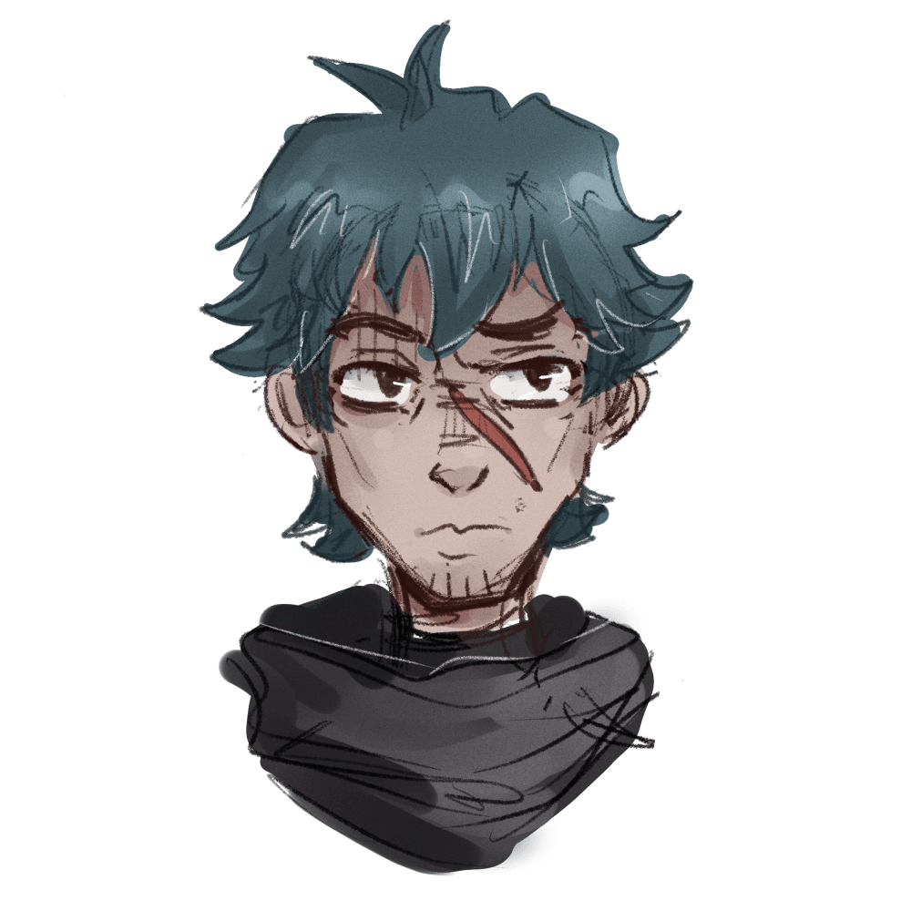
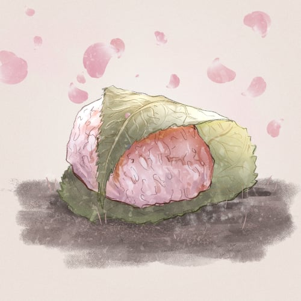
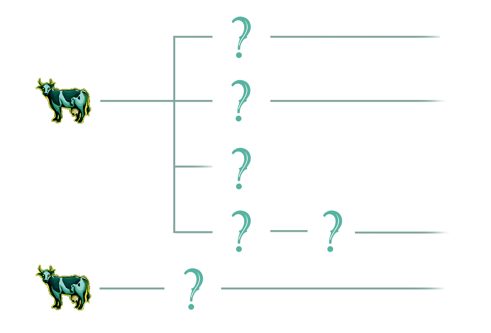

# Introduction

I’m Starving is an on-chain, story driven community experience and game on Arbitrum.

The whole concept is divided into 3 stages.

1. The story of STAR.
2. Cooking and questing.
3. PvP ranked card game.

I’m Starving will introduce multiple types of NFTs:

* ★ (STAR) – The brave hero of the Starving Story, minted only by whitelisted members of our [Discord](https://discord.gg/x83tHnF5KE).
* SPIRIT – Our cooks and in game avatars.
* FOODs – Collect up to 50 by questing in our game.
* DISHes – Craft hundreds of different DISHes by cooking with SPIRITs.

In addition we are offering Genesis SPIRIT to investors.

## $MAGIC

If you are new to Treasure ecosystem, you might want to learn first about $MAGIC: [Start with Magic](https://startwithmagic.com/).

# Stage 1

## The Mint

### ★

★ is our main character and the main NFT. We have a system of assigning multiple WL roles on [Discord](https://discord.gg/x83tHnF5KE) that translate to more mints.

1 WL role = 1 ★ mint.

To get the most out of our game, you should mint the max ★ so that you can participate in the SPIRIT crafting (more info on that in due course).

> 

Each minted ★ begins as a virgin, clean slate with no stats. That means they have no rarity and metadata is clean. You will need to stake them into the Starving Story to have any use of them.

In order to understand better why all ★s start as the same person, we encourage you to read our Lore.

### The Starving Story

The Starving Story is where the stats and rarity will come together. The Story is a dynamic staking contract.

The moment a holder stakes their ★s, they become a part of the Story and start changing. All staked ★s change in tandem, at the same time and have exactly the same metadata. In order to stop those changes and freeze a ★, a holder needs to remove him from the Story (unstake).

The Starving Story is divided into 5 Acts, 10 Scenes each. Together there are 50 distinct Scenes (images), each one representing a different FOOD or a meal containing that FOOD.

One Scene will take approximately 4 days.

★s can join the Story only during first Scenes of each Act:

* Scene 1
* Scene 11
* Scene 21
* Scene 31
* Scene 41

Holders can leave the Story (unstake) at any moment.

### Community decides on rarity

Leaving the Story, i.e. unstaking ★s freezes their metadata. Frozen ★s represent a one moment of the Starving Story. Each one will be unique, but some might have similar stats.

If many holders freeze their ★s at the same time, those ★s would become common. If only one or a few holders freeze, then those ★s would be more unique and thus rarer.

Only frozen ★s can take part in quests. Every holder will need to decide when is the best time to unstake.

In addition, holders of many ★s will need to consider a few things:

* do they want to have at least one ★ in each Act to take part in different quests?
* do they want to collect a whole Act to have a chance in summoning SPIRITs?
* do they want to time their unstakes to maximize rarity of their stats?

★s stats will have a few consequences. They will influence what prospects they have during questing and what kind of SPIRIT they can summon.

# Stage 2

In this stage you will start to quest and find FOODs.
## FOODs

There are 50 different FOOD NFTs. You can think of them as Treasures. FOODs are divided into 5 groups, as there are 5 Acts in the Story. You can obtain FOODs through questing. There are 5 quests, one for each Act:

1. Forage
2. Trip,
3. Hunt,
4. Feast,
5. Zen.

★s can only quest in the Act that they are frozen in. Example:

* ★ is frozen on Scene 3. He can only do ******* quest (Act 1).
* Another ★ is frozen in Scene 25. He can only do **** quest (Act 3).

FOODs have rarities and different drop rates. Each holder will be able to influence the drop rate by holding our partner NFTs or by staking $MAGIC.

FOODs will be used in cooking to create DISHes, MEALs and FEASTs. Our cooks are called SPIRITs.

## SPIRIT

Each Act has its patron – a SPIRIT that is overwatching ★ on his journey. In addition, each SPIRIT has different forms, depending on the stats of ★s that summon it. That makes 5 different SPIRITs and each of them has 2 different forms.

In order to summon a SPIRIT, the player needs to hold 10 ★s. Each ★ needs to be frozen in a different Scene from the Act. That means they need to hold ★s that show all 10 Scenes of the Act. ★s that are used to summon a SPIRIT die (tokens are burned). Stats of burned ★s determine stats of the SPIRIT.

## DISH, MEAL, FEAST

Each FOOD can be used in cooking. Each SPIRIT type will have its own skill tree that uses FOOD from its Act and, after learning new skills, FOODs from other Acts and Treasures.

> 

All NFTs used in cooking will be burned in exchange for the new DISH, MEAL or whole FEAST. Treasures used in cooking will also be burned.

We plan to use most of T5 Treasures, a few T4 and at least one T3.

> 

The skill tree is developed individually for each SPIRIT type. It will need to learn basic skills first before it can start making more complicated recipes.

# Stage 3

## PvP ranked card game

Soon.

# Socials

## Discord
We will publish mint details and more info on our [Discord](https://discord.gg/x83tHnF5KE).

## Twitter
